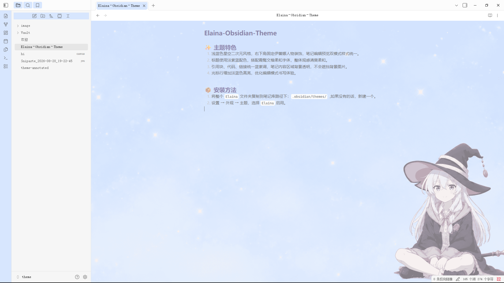

# Elaina‑Obsidian‑Theme
> 魔女之旅伊蕾娜 Obsidian 浅色自定义主题

## 主题预览

## ✨ 主题特色
1. 浅蓝色星空二次元风格，右下角固定伊蕾娜人物装饰，笔记编辑预览双模式样式统一。
2. 标题使用淡紫蓝配色，搭配霞鹜文楷柔和字体，整体观感清爽柔和。
3. 引用块、代码、链接统一蓝紫调，笔记内容区域背景透明，不会遮挡背景图片。
4. 光标行增加淡蓝色高亮，优化编辑模式书写体验。

## 📦 安装方法
1. 将整个 `Elaina` 文件夹复制到笔记库路径下：`.obsidian/themes/`
2. 设置 → 外观 → 主题，选择 `Elaina` 启用。

